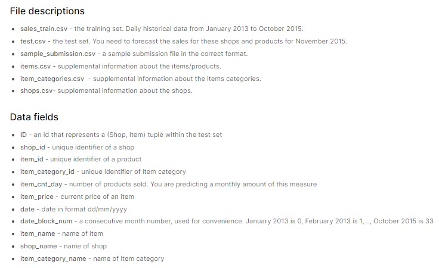

# ML-Retail-Sales
> This repository helps us to capture retail sales events and provide us forecasted sales. Classical ML algorithms such as xgboost regression is utilized to predict these sales nos.

## Table of Contents
* [General Info](#general-information)
* [Technologies Used](#technologies-used)
* [Features](#features)
* [Screenshots](#screenshots)
* [Setup](#setup)
* [Dataset Utilized](#dataset-utilized)
* [Usage](#usage)
* [Project Status](#project-status)
* [Room for Improvement](#room-for-improvement)
* [References](#references)
* [Acknowledgements](#acknowledgements)
* [Contact](#contact)
<!-- * [License](#license) -->

## General Information
- The aim of this repository is to implement a ML Retail Sales Pipeline which covers vital pointers to capture trends and seasonality in sales data by incorporating Feature Engineering script, Training Script and Inferencing Script.
- This work will help Data Science professionals gather knowledge on capturing retail sales and how to approach any such problem statement.
<!-- You don't have to answer all the questions - just the ones relevant to your project. -->

**Flow of Project**:  
1. **EDA:** EDA covered certain sections such as:
    a. Data Sourcing  
    b. Data Cleaning - (Handling Missing Values, Handling Duplicated Values, Handling outliers)  
    c. Univariate Analysis  
    d. Bivariate Analysis  
    e. Multivariate Analysis
2. **Pre-Processing:** Following steps are being followed for preprocessing the sales data before feature enginnering part is run  
    a. Based on unique dates (date_block_num), grid is formed among unique shop ids and item ids.  
    b. Sales are brought from daily level to montly level aggregation where item count is "summed" and price of an item is "averaged" out.  
    c. Dataframes obtained from step (a) & (b) are merged together and wherever item count per month is 'NA', they are filled up with 0.  
    d. item categories are also added to dataframe from step (c).  
3. **Feature Engineering:** 10 feature engineering steps are compiled together to generate the train ready dataset.  
    a. 

## Technologies Used
- XGBoost
- Python 

## Features
List the ready features here:
- Exploratory Data Analysis (EDA) Script - Done
- Feature Engineering Script - Done
- Modelling Script - Done
- Inferencing Script = To Be Started

## Screenshots

## Setup:
- git clone https://github.com/ManashJKonwar/IP-Pointnet.git (Clone the repository)
- python3 -m venv IPPointnetVenv (Create virtual environment from existing python3)
- activate the "IPPointnetVenv" (Activating the virtual environment)
- pip install -r requirements.txt (Install all required python modules)

## Dataset Utilized:
- Retail Dataset is obtained from Kaggle and competition name is [Predict Future Sales](https://www.kaggle.com/competitions/competitive-data-science-predict-future-sales/data).
- Please refer to screenshot below for dataset descriptions and data fields within this dataset.

## Usage
### For Training PointNet:
- python train_pointnet.py
### For Running Web Application:
- python index.py

## Project Status
Project is: __in progress_ 
<!-- / _complete_ / _no longer being worked on_. If you are no longer working on it, provide reasons why._ -->

## Room for Improvement
Room for improvement:
- Build a generic classifier for custom 3d dataset
- Build a generic part segmenter for custom 3d dataset
- Build a generic semantic segmenter for custom 3d dataset
- Develop frontend to encompass this generic nature
- Porvide support for CPUs, GPUs and TPUs as well

To do:
- Finish developing inference end of part segmenter at DASH end
- Start developing semantic segmenter

## References
[1] PointNet: Deep Learning on Point Sets for 3D Classification and Segmentation; Charles R. Qi, Hao Su, Kaichun Mo, Leonidas J. Guibas;
CVPR 2017; https://arxiv.org/abs/1612.00593.

## Acknowledgements
- This project was based on [Point cloud classification with PointNet](https://keras.io/examples/vision/pointnet/).
- This project was based on [Point cloud segmentation with PointNet](https://keras.io/examples/vision/pointnet_segmentation/).

## Contact
Created by [@ManashJKonwar](https://github.com/ManashJKonwar) - feel free to contact me!

<!-- Optional -->
<!-- ## License -->
<!-- This project is open source and available under the [... License](). -->

<!-- You don't have to include all sections - just the one's relevant to your project -->